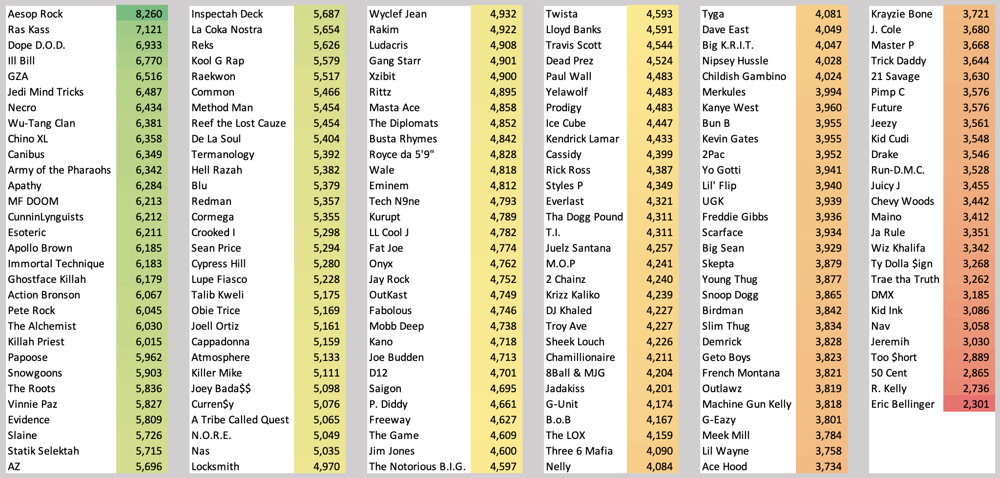
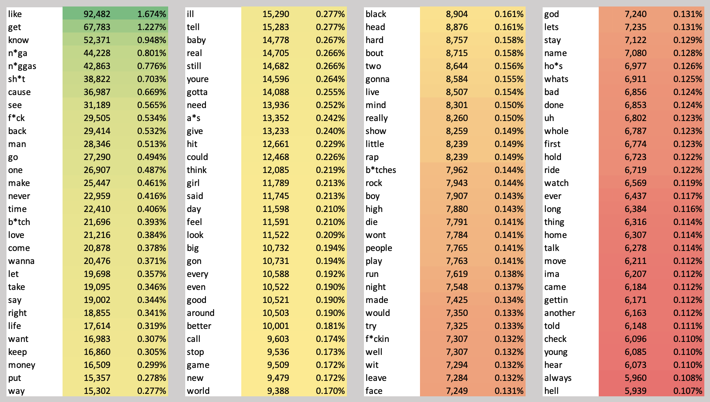
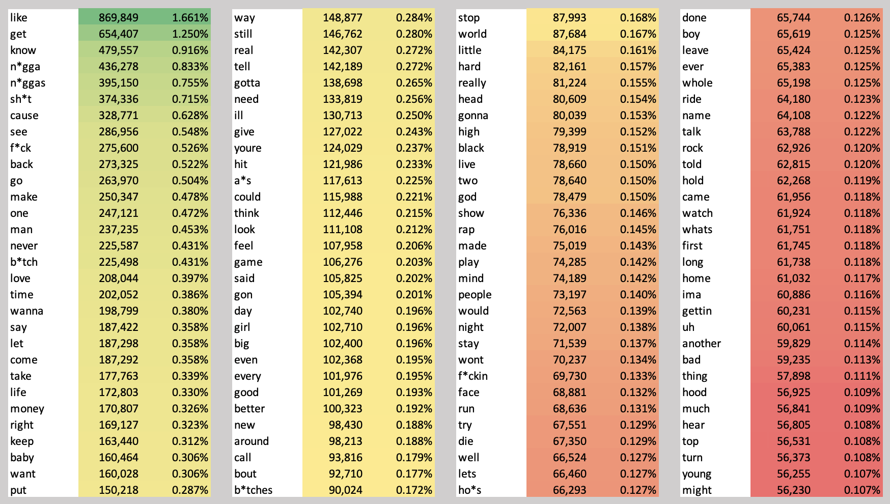

# Hip Hop Analytics
 A Repository for Hip-Hop Analytics Project

This repository contains files used for my Hip-Hop Analytics project. 

## Disclaimer

This analysis was conducted just of personal interest and for personal needs. It is just a personal experience. It does not imply any advice or pretend to be truthful. The code presented here can be definitely improved in quality. The resultsts are subjective and may deviate from reality.

However I would welcome any friendly discussions, questions, suggestions and comments. Please also be free to use this analysis in parts or in full for any purposes, yet reference would be appreciated. :) 

## Foreword

This analysis was firstly inspired by [The Largest Vocabulary In Hip Hop by Matt Daniels](https://pudding.cool/projects/vocabulary/index.html) and secondly by [2017 Rap Albums’ Text Mining and Sentiment Analysis by Hugo-Nattagh](https://github.com/Hugo-Nattagh/2017-Hip-Hop).

Big credit goes to these authors as well as the authors of the libraries that made the work substantially easier: [rymscraper by dbeley](https://github.com/dbeley/rymscraper) for collecting data from [Rateyourmusic.com](https://rateyourmusic.com/) and [lyricsgenius by johnwmillr](https://github.com/johnwmillr/LyricsGenius) for the Python client for the [Genius.com](https://genius.com/) API.

## Goals

The main goals of this analysis are:
* Determine "the best lyricist" among set of artists by examining lyrics of their albums and counting the number of unique words.
* Find the most frequently used words within the given set of artists.
* Perform sentiment analysis on the given artists and see, whose creates most positive or negative lyrics in their songs.

## Structure

The main part of the repository consists of 4 python scripts:
1. `data_gathering.py`: gathers specified albums with help of Rateyourmusic.com and Genius.com
1. `word_count.py`: determine the best lyricist by calculating unique words for each artist
1. `wordclouds.py`: get the most frequently used words
1. `sentiment_analysis.py`: perform sentiment analysis on the albums and get sentiment score for each artist

## How to reproduce and make own analysis:

* Environment used: MacOS Big Sur 11.1 (Intel), Python pyenv+miniconda+3.8.5 / pyenv+3.9.0
* Carefully install all the dependencies
 * `lyricgenius` should be installed from GitHub version, as pypi version does not support `search_album` function.
 * `rymscraper` should not be downloaded (as it is the part of this repo) but should be installed according to the instructions on their page. The reason for that is the problems with adding path to geckodriver on my machine. Now it should be working out of the box, if geckodriver was installed by `brew install geckodriver`. 
* In order to collect artists, `rapper_list.csv` should be filled with the 1) names of the artists (as they are named in RYM), collected flag 0=no, 1=yes (i.e. to collect, they should be 0), and url - if there are problems collecting artist by name, a url to his page on RYM should be supplied (e.g. in case there are multiple artists with the same/similar name). If 0 is supplied to url, artist will be looked up by name. Example:

| names     | collected | url                                           |
|-----------|-----------|-----------------------------------------------|
| Havoc     | 0         | https://rateyourmusic.com/artist/havoc_f1     |
| Locksmith | 0         | https://rateyourmusic.com/artist/locksmith_f2 |
| Necro     | 0         | https://rateyourmusic.com/artist/necro        |
| The Game  | 0         | https://rateyourmusic.com/artist/the-game     |
| Blu       | 0         | https://rateyourmusic.com/artist/blu_f1       |
| 21 Savage | 0         | 0                                             |
| 2 Chainz  | 0         | 0                                             |
| 2Pac      | 0         | 0                                             |

* Add file `config.py` with the variable `token = "XXXX"`, where `XXXX` represents token for Genius API (see `lyricsgenius` GitHub for instructions)
* Working directory is assumed the directory of the scripts.
* Run `data_gathering.py` to gather the files. Possible changes in parameters in the beginning of the script: `to_collect = 2` -  determines what to collect; 0 - collect albums, if 1 - albums+eps, if 2 - albums+eps+mixtapes (all).
* Run `word_count.py` to calculate unique words. Possible changes in parameters in the beginning of the script: `max_length = 35000` - change the number of words to be collected/pursued for each artist `to_collect = 2` -  If 0 - collect albums, if 1 - albums+eps, if 2 - albums+eps+mixtapes (all).
* Run `wordclouds.py` to gather wordlouds and word frequencies. Possbile parametrs are the same as for `word_count.py`, plus: `exit_on_max_length = True` - if true, gathers up to the max words, if `False`, collects all available albums. `additional_stopwords =` - list of additional stopwords to `nltk` package to exclude from the analysis, `album_clouds = False` - if true output wordclouds for each album, if flase - only for artist overall.
* Run `sentiment_analysis.py` for sentiment analysis. Possible parameters: `to_collect = 2` and `additional_stopwords =` , similarly to previous files.

The output lists for each part with in detail data saved as `.pickle` files:
* `unique_words.pickle` - output for `word_count.py`
* `frequent_words.pickle` - output for `wordclouds.py`
* `sentiment.pickle` - output for `sentiment_analysis.py`

## The Idea

### Data Gatheing

For data gathering, `rymscraper` and `lyricsgenius` libraries were used. At first, I have defined the list of hip-hop artist I wanted to add into analysis, which in the first iteration resulted in 259 artists (or groups) from my personal preferences. Full list is located in the `artist_info.xlsx` workbook. 

Their songs were gathered in two phases:
1. Gather the discography of the artist from [Rateyourmusic.com](https://rateyourmusic.com/) (RYM for short). The goal was to collect as much discography as possible, including studio albums, EPs (extended plays) and mixtapes. The key information required from RYM was album names,release years and album type (album, EP, or mixtape).
1. After the list was made, each album name was looked in [Genius.com](https://genius.com/) records. In case there were lyrics (at least for the part of the album), they were collected and stored in JSON file formats.

The collected list for Eminem as an example:

| Artist | Album                     | Year | Type    |
|--------|---------------------------|------|---------|
| Eminem | Infinite                  | 1996 | Album   |
| Eminem | The Slim Shady LP         | 1999 | Album   |
| Eminem | The Marshall Mathers LP   | 2000 | Album   |
| Eminem | The Eminem Show           | 2002 | Album   |
| Eminem | Encore                    | 2004 | Album   |
| Eminem | Relapse                   | 2009 | Album   |
| Eminem | Recovery                  | 2010 | Album   |
| Eminem | The Marshall Mathers LP 2 | 2013 | Album   |
| Eminem | Revival                   | 2017 | Album   |
| Eminem | Kamikaze                  | 2018 | Album   |
| Eminem | Music to Be Murdered By   | 2020 | Album   |
| Eminem | Slim Shady EP             | 1997 | EP      |
| Eminem | Anger Management 3        | 2005 | Mixtape |

If the album was already downloaded, it is skipped, not to waste time on the double downloads.

**NB!** Oftentimes it was not possible to collect the entire discography for an artist and there might be several known reasons for that, e.g.:
* Lyrics for that were not available / Album is not present on Genius website - yet it is mostly the case for mixtapes and sometimes EPs. For most of the studio albums, it is not usual for them to be missing. 
* Album name on RYM and on Genius do not match. While Genius API allows to have the not exact name in search, sometimes they were too diferent. A good example: _Music to Be Murdered By Side B_ by Eminem, which in RYM records went with the full name of _Music to Be Murdered By Side B (Deluxe Edition)_. That "Deluxe Edition" marker made it impossible to collect from Genius. Yet again, there are not so many cases affecting studio albums and they are the core part of this analysis.
* Some albums may not be collected due to misc problems, like network failures, but therse should be minimal and should not have significant impact.

### Determining the Best Lyricist

As the baseline for this analysis was the publication [The Largest Vocabulary In Hip Hop by Matt Daniels](https://pudding.cool/projects/vocabulary/index.html), I've decided to go with the similar style. In order to determine the vocabulary of the artist, first 35,000 words (around 3-5 albums) from his albums were collected. If albums did not cover 35,000 words, EPs were added and if again not, lastly mixtapes. 

A little bit of text processing was applies to each song, including removing song related data that usually comes in brackets or parenthesis (lines like "Verse 1: Eminem"), stopwords, conversion to lowercase, removal of punctuation, etc. 

**NB!** However, similarly as in the original publication, there are many limitations:
* _Each word is counted once, so pimps, pimp, pimping, and pimpin are four unique words. To avoid issues with apostrophes (e.g., pimpin’ vs. pimpin), they’re removed from the dataset. It still isn’t perfect. Hip hop is full of slang that is hard to transcribe (e.g., shorty vs. shawty), compound words (e.g., king shit), featured vocalists, and repetitive choruses._ [Cited from Matt Daniels](https://pudding.cool/projects/vocabulary/index.html) 
* Guest verses and appearances are also not removed as it is practically impossible, as in lyrics text it is not always clear stated, who is doing the following verse or chorus. 

### Find the Most Frequent Words

In addition, I though it might be interesting to see, which words are the most frequent ones for each artist and across all the selected artists. Similar text processing techniques are applied and then frequency of words for each artist are calculated, both in absolute and relative (% of total) metrics. In addition, wordcloud images are generated for each artist.

It is possible to either use the same logic as for unique word count - first 35,000 word are calcualted and most frequent words are derived from there. That ensures consistent total output - we may analyse what are the most popular words across all the artist, despite some of them are having more albums and songs. Or, it is possible to not limit the word count, then all the albums for each artist are taken into consideration. That makes more sense for single artist analysis.

### Sentiment Analysis

Sentiment analysis was performed on the same list of artists and albums using `nltk Vader`. After (very) short pre-processing, the sentiment was calculated for every line of the song separately. The average sentiment of all lines made sentiment of the song. THe average song sentiment resulted in album sentiment and finally, the average of all album sentiments gave the final artist sentiment. 

This time, the analysis was limited only to studio albums, yet there was no limit on words - for each artist the metric is calculated independently, so it does not matter (a lot) how many albums does each artist have.

For final sentiment `compound` score by `Vader` was taken. According to [Vader on GitHub](https://github.com/cjhutto/vaderSentiment):
_It is also useful for researchers who would like to set standardized thresholds for classifying sentences as either positive, neutral, or negative. Typical threshold values are:_
* _positive sentiment: compound score >= 0.05_
* _neutral sentiment: (compound score > -0.05) and (compound score < 0.05)_
* _negative sentiment: compound score <= -0.05_

**NB!** Although, these sentiment calcaltions again are not perfect (see previous **NB** marks), it might give an overall sense of the difference in sentiment accross artists.

## Results

The following are the results:

### Determining the Best Lyricist

The results turned out similar as in the originial puclication:
* **Aesop Rock** is out of the league with more than 8,000 unique words, while the closest competitor is just above 7,000.
* **Ras Kass** was not present in the original analysis and hence it is interesting to see him residing on the place 2.
* Generally, we may see expected results. The artists which are associated with concious or underground rap are mostly on top (e.g., **Ill Bill:#4**, **Jedi Mind Tricks:#7**,  **Necro:#8**, **Chino XL:#10** **Canibus:#11**, etc.
* **Wu-Tang Clan** members are also ranked very high: **GZE:#6**, **Ghostface Killah:#18**, **Inspectah Deck:#31**, **Raekwon:#37**, **Method Man:#39** and **Wu-Tang** as the group itself - **#9**. 
* Big names like **Ja Rule**, **50 Cent** or **Too $hort** found themselves at the bottom alongside mostly new-school rappers.

### Find the Most Frequent Words

The most used words were calculated for each artist's 25,000 words, **excluding stopwords**. So it is different than used for unique word count, but is having about the same number of available artists to examine. Here are the top 120 words (resulted in 5,525,000 words):

* **like** tops the list with more than 1.5% of all words, but it is really generic.
* **n-words** (#4 & $5 combined) would've been at least number #2, again - no surprise! Other swearwords are also in the top...
* Otherwise there are mostly generalized words, equally distributed between words like **love**, **die**, **life**, **god** - a true evidence that rap might be different!

And what about the least used words? Apart from lots of misspels and mis-processed words, there were lots of words used only once. Here are the few I found interesting and funny:
* **acknowlegde** - there are only about 120 variations of the verb acknowledge in the results, yet the word "acknowlegde" itself appears only once.
* **admirable** - nobody finds things admirable in rap
* **backend** - sadly only once, yet more than fronend, which is zero :)
* **chewbaka** - total 17 mentions in various forms!
* **demigodzilla** - awesome wordplay!
* **exploration** - very few explorers and only once exploration, definitely does rhyme well...
* **gameplay** - rap is game, but nobody talks about the gameplay!
* **globalization** - yep, this issue is left aside.
* **liquidate** - rap is the nice genre, liquidation is not an option!
* **megasaurus** - paleontology!
* **paintballin** - awesome wordplay! x2
* **patronymic** - as a person who technically have one, I find this offending...
* **smartphone** - I know most lyrics were from early albums, but really, just once?
* **transsexual** - same as smartphone, prob too new word to speak about it...
* **wikipedia** - it's good to have some facts!

And that would be the top-120 list gathering **all** selected artists' studio albums and EPs (no mixtapes):

While some word order is changed and there are other words present, they still are mostly generic. Yet it seems that swearwords have gone up in general...

### Sentiment Analysis

* As we can see, artists like **R. Kelly** or **Mos Def** are leading positive vibe section, which again not really surprising.
* Most of the artit fall into category between 0.05 and -0.05 which traditionally is categorized as neutral.
* Still, there are much more negative sentiment of less that -0.05 than positive, as hip-hop is traditionally a "darker" music style than others and this confrims it.
* The negative sentiment is lead by unsurprisingly gangsta nad conscious rappers, like **N.W.A**, **Geto Boys**, **D12**, **La Coka Nostra**, but what surprises - the appearance of **Bankroll Mafia**, a group/label lead by **T.I** - who rap mostly about getting money and all that stuff and himself being with only a bit of negative sentiment.

## Licensing

MIT License
Copyright (c) 2021, Artjoms Formulevics

### For RYM package:

MIT License

Copyright (c) 2019, David Beley

Permission is hereby granted, free of charge, to any person obtaining a copy
of this software and associated documentation files (the "Software"), to deal
in the Software without restriction, including without limitation the rights
to use, copy, modify, merge, publish, distribute, sublicense, and/or sell
copies of the Software, and to permit persons to whom the Software is
furnished to do so, subject to the following conditions:

The above copyright notice and this permission notice shall be included in all
copies or substantial portions of the Software.

THE SOFTWARE IS PROVIDED "AS IS", WITHOUT WARRANTY OF ANY KIND, EXPRESS OR
IMPLIED, INCLUDING BUT NOT LIMITED TO THE WARRANTIES OF MERCHANTABILITY,
FITNESS FOR A PARTICULAR PURPOSE AND NONINFRINGEMENT. IN NO EVENT SHALL THE
AUTHORS OR COPYRIGHT HOLDERS BE LIABLE FOR ANY CLAIM, DAMAGES OR OTHER
LIABILITY, WHETHER IN AN ACTION OF CONTRACT, TORT OR OTHERWISE, ARISING FROM,
OUT OF OR IN CONNECTION WITH THE SOFTWARE OR THE USE OR OTHER DEALINGS IN THE
SOFTWARE.
